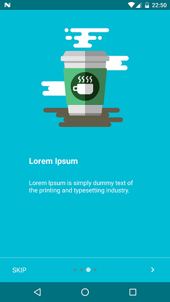

# Meet-My-App

## Simple application intro




#Installation
-----------------------


Gradle:
```groovy
compile 'com.github.armcha:MeetMyApp:0.3.2'
```
Maven:
```xml
<dependency>
  <groupId>com.github.armcha</groupId>
  <artifactId>MeetMyApp</artifactId>
  <version>0.3.2</version>
  <type>pom</type>
</dependency>
```

I am so lazy to add description, sorry :smile: :scream:

Please anyone if you have time add description  :joy: see [sample][1] here 
[1]: https://github.com/armcha/Meet-My-App/tree/master/app/src/main

Set your activity style ```android:theme="@style/MeetMyAppStyle"```
```xml
   <activity
            android:name=".MainActivity"
            android:theme="@style/MeetMyAppStyle">
            <intent-filter>
                <action android:name="android.intent.action.MAIN" />
                <category android:name="android.intent.category.LAUNCHER" />
            </intent-filter>
        </activity>
```

```java
public class MainActivity extends BaseIntroActivity{

 @Override
    public void init(@Nullable Bundle savedInstanceState) {
        addFragment(new FragmentItem(R.layout.your_layout, ContextCompat.getColor(this, R.color.yourColor)));

        //Options, intro will also work without this options
        setVibrate(true);
        setNextImage(R.drawable.next_icon);
        setSkipText("SKIP");
        setDoneText("DONE");
        showSkipButton(true);
    }
}
```

Your layout should not contain background attribute


