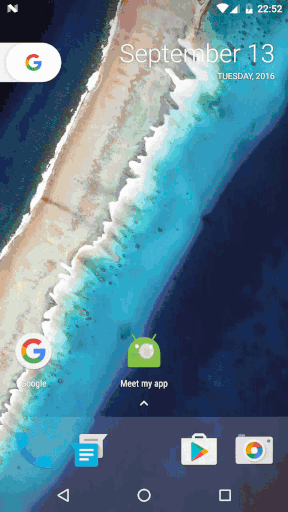

# Meet-My-App

## Simple application intro





#Installation
-----------------------


Gradle:
```groovy
compile 'com.github.armcha:MeetMyApp:0.3.1'
```
Maven:
```xml
<dependency>
  <groupId>com.github.armcha</groupId>
  <artifactId>MeetMyApp</artifactId>
  <version>0.3.1</version>
  <type>pom</type>
</dependency>
```

I am so lazy to add description, sorry :smile: :scream:

Please anyone if you have time add description  :joy: see [sample][1] here 
[1]: https://github.com/armcha/Meet-My-App/tree/master/app/src/main

```java
public class MainActivity extends BaseIntroActivity{

 @Override
    public void init(@Nullable Bundle savedInstanceState) {
        addFragment(new FragmentItem(R.layout.your_layout, ContextCompat.getColor(this, R.color.yourColor)));
    }
}
```

Your layout should not contain background attribute


